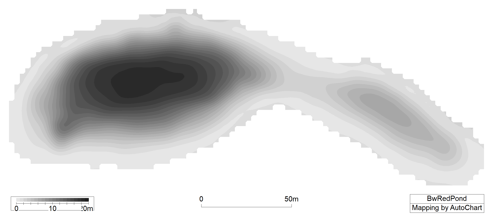

# make-bathy-maps-from-autochart

Need to make a bathy map from the files spit out by Autochart? :computer: :ocean: :world_map:

This repository contains codes written in R that use .kml and .tif files from Autochart (or Google Earth) to make nice maps of lake bathymetry. 

Two options: 

| Files you have  | | Code to use | 
| ------------- |-------------| ------------- |
| Grayscale Autochart .kml and .tif file | :arrow_right: | `BathymetryFromAutochart.R`| 
| Google Earth polygons as a .kml file,   where each polygon is named following   'contour #m', where # is the depth | :arrow_right: | `BathymetryfromGoogleEarth.R`|

# Examples 

Example Grayscale Autochart .tif file.  

Both codes will produce a bathymetry map, with contours colored by their depth. 

These maps can be overlaid on topography/LiDAR.  

# Ideas for improvement 
* Would be great to use raw Autochart tracks (i.e. no conversion to grayscale and contour interpolation in Autochart software first).
* Is there an easier way to "plot" the bathymetry on top of LiDAR or other basemaps? (rather than making a transparent background bathy map, then overlaying onto base map). RGT has done in ArcGIS before.
