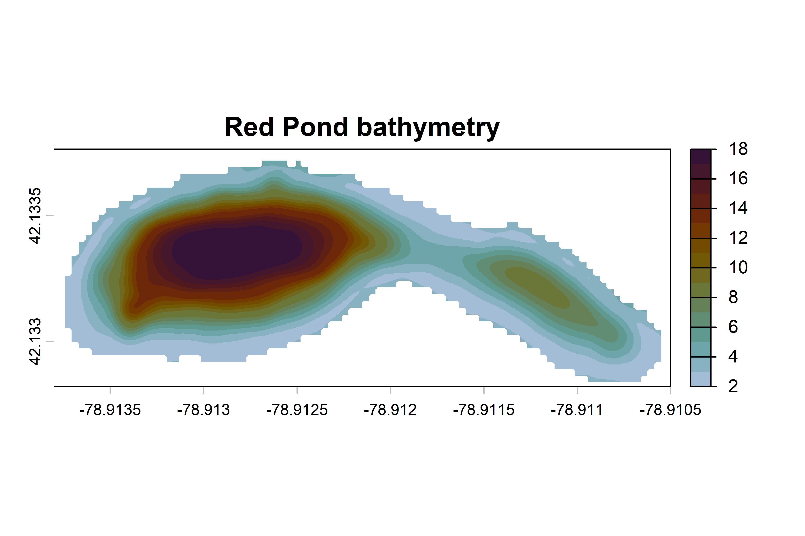
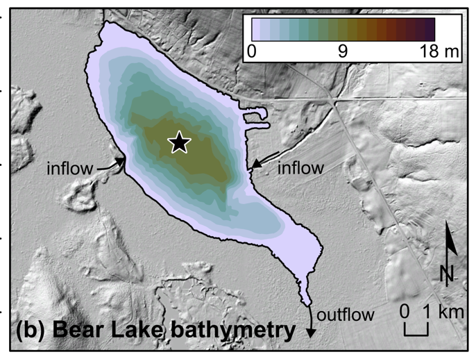

# make-bathy-maps-from-autochart

Need to make a bathy map from the files spit out by Autochart? 

This repository contains codes written in R that use .kml and .tif files from Autochart (or Google Earth) and make nice maps of lake bathymetry. 

Two options: 

| Files you have  | Code to use | 
| ------------- | ------------- |
| Grayscale Autochart .kml & .tif file  | BathymetryFromAutochart.R  | 
| Google Earth polygons as a .kml file  | BathymetryfromGoogleEarth.R  |

Example Grayscale Autochart .tif file.

These maps can be overlaid on topography/LiDAR.  

